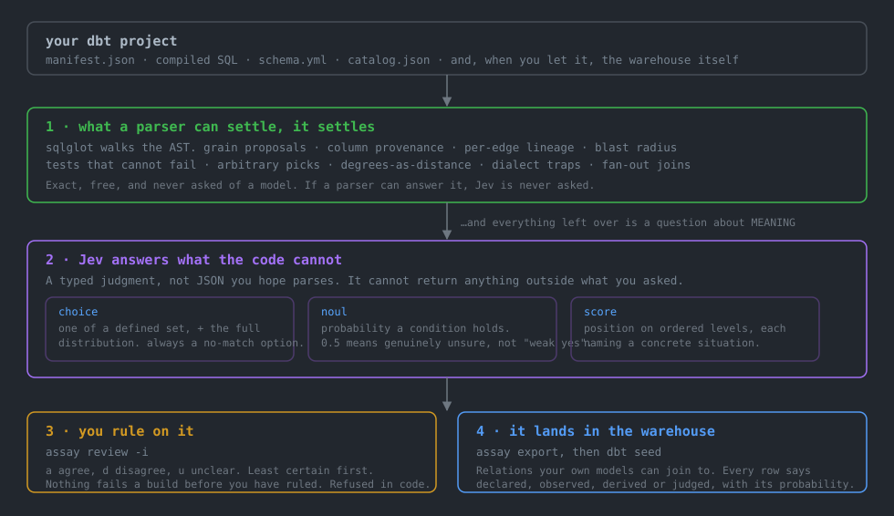

# assay


*I say, I say — assay.*

**Recover the semantics your warehouse never wrote down.**

Your dbt project has types nobody declared. Every model has a grain, every number has a unit, every
nullable column has a meaning for null, and every model assumes something about what its parents
already did. None of it is written anywhere, all of it is load-bearing, and the only copy lives in
the head of whoever last debugged it.

`assay` infers those semantics from the code, stores them as data, and finds the places where they
contradict each other.

[sqlglot](https://github.com/tobymao/sqlglot) reads the structure. [TypeSafe's
Jev](https://docs.typesafe.ai) reads the meaning. SQL does the rest.

> Built while auditing a Colorado water rights warehouse, where a case number is only unique inside
> a water division and nothing in the stack could tell me that.

**New here? [docs/PRODUCT.md](docs/PRODUCT.md) is the whole thing in plain words** — what it checks, how it works next to a coding agent, what it costs, and what it deliberately will not do.

## What it finds

A staging model in that warehouse described itself like this:

> *"Boulder commercial building permits (residential filtered out)."*

The filter excludes exactly two substrings, `%single family%` and `%dwelling%`. Of the 14,150 rows
that survive it, 373 are non-residential, **157 are explicitly `building permit - multifamily`**,
and 13,620 are trade permits with no commercial distinction at all — so residential roofing jobs
were going out as commercial leads through 19 downstream models.

Valid SQL. Passing tests. A description that is simply false. **No linter reaches that**, and the
judgment that did cost $0.0026 across the whole 265-model project.

The same run found a `join irr i on p.xmin <= i.xmax and p.xmax >= i.xmin` — a bounding-box
*overlap* join feeding a mart, where one parcel matches many polygons and every count past it is
inflated while each individual row stays valid.

```bash
uvx dbt-assay onboard --target path/to/dbt/target
```

On a project `assay` has never seen: it reads your manifest, says what it can and cannot see, runs
the structural checks, runs the judgment tier if a key is present, writes an `audit.yml` that gates
nothing, and prints the next command. `--agent` also writes the skill file your coding agent
follows.

## How it works



**The structural tier is what makes the judged tier safe.** Blast radius comes off the DAG, so a
judged finding can be *ranked* without trusting the judgment. `assay patch` refuses a proposed test
by *counting* it rather than by asking. Everywhere this has been right, code did the deciding and
judgment did the noticing.

**So the parser and the judgment are not two products.** They are one division of labour, and it is
the whole design: *if a parser can answer it, Jev is never asked.* A grain, a column's provenance,
a test that cannot fail — those are facts, settled exactly and for free, and putting them to a
model would be spending money to make a certainty approximate.

What is left over is not a gap in the parser. It is a different kind of question.

```sql
where status != 'CANCELLED'
```

That is domain logic, a patch over a bad feed, or the thing that makes the model mean what it
means. **The SQL is identical for all three**, no parser will ever separate them, and which one it
is decides whether the line gets deleted next quarter or guarded forever.

That is the question `assay` exists to answer, and it is why Jev is not an add-on.

## Read next

- **[Full overview](docs/OVERVIEW.md)** — every command, every question, every config block, and
  how to run this as a standing part of a warehouse rather than a one-off audit.
- **[What has actually been verified](docs/VERIFICATION.md)** — per family, whether a person has
  read its findings against the real thing. Two families failed their own controls and were
  rewritten; it names the ones nobody has checked.
- **[Field notes](docs/FIELD_NOTES.md)** — someone else using it on a 357-model warehouse, kept as
  reported. Most entries found a defect in the checker rather than in the warehouse.

## Status

Both tiers work. **Run it with a key.** The structural tier needs nothing but your manifest and is
genuinely useful — it found 50 tests that cannot fail in a 357-model warehouse — but it is a very
good linter, and a linter is not the point. The point is a warehouse that knows what it means, and
meaning is the half a parser cannot reach.

Ten of seventeen question families have had their findings read against real data by a person; two
failed that and were rewritten; [docs/VERIFICATION.md](docs/VERIFICATION.md) says which, and which
five have not been checked at all. Nothing gates a build in either tier until a question has recorded your
verdicts, and `assay` refuses rather than warns.

## The inventory

```bash
assay inventory                     # every model: grain, columns, reach
assay inventory --model water_rights  # one model, in full
assay inventory --write contracts.yml # a SEPARATE file; your schema.yml is never touched
```

Not a findings list. *Here is what every model in your project actually is.* On a 356-model
warehouse: grain settled for 250, 4,684 columns classified.

**Every cell says where it came from.** `declared` (a human wrote it), `observed` (the probe counted
it), `derived` (code worked it out) or `judged` (with the probability). A fact resting on an
unresolved premise says so rather than inheriting confidence it did not earn.

## The page

```bash
assay inventory --html docs/warehouse.html
```

One self-contained file: every model, what one row is, what each column does, where each value came
from, and **who said so**. Colour-coded, searchable, no build step, opens from a `file://` URL.
Commit it and a change in what your warehouse MEANS shows up as a diff.

dbt docs shows you lineage. This shows you meaning.

## On the pull request

```yaml
- uses: ryan-sunny/dbt-assay@v0.27.1
  with:
    target: target-head
    baseline: base/target
    store: assay.duckdb      # optional: commit or cache it and judged findings post too
```

Posts what changed about what your models mean, who consumes it, and how many of those aggregate
over it. It does **not** gate by default: nothing should fail a build until its question has
recorded verdicts, and assay refuses to anyway.

There is no `dialect:` line because the manifest names its own adapter. Pass one only to override.
An earlier version of this action defaulted it to `duckdb`, which silently misparsed every other
warehouse: on a BigQuery project that turned 12 parse failures into 128 and lost two real findings,
without changing how confident the output looked.

## Ruling on findings, one keypress each

```bash
assay review -i
```

```
column_role  zip_tiers
  role = measure  confidence 1.00
  models/marts/zip_tiers.sql · 0 downstream, 0 marts
  monthly_price = CAST(GREATEST(5, ROUND(12 * a.leads_per_week * pr.price_multiplier))
  comes from: computed — derived here by an expression
```

`a` agree, `d` disagree, `u` unclear, `s` skip. Least certain first, because a verdict on an answer
already given at 0.99 teaches almost nothing and one on a 0.45 is where the question is actually
being decided.

The evidence is on screen because a verdict nobody can reach in five seconds does not get given.

```bash
assay review --from-labels     # verdicts from assertions already in your project
```

A `unique` test says a column is an identifier; a declared key says what one row is; a join says two
columns are the same concept. Those are real human judgments, made earlier, and they are recorded
as `label` rather than `human` — evidence about a question, never permission for it to fail a
build, because the label can itself be the thing that is wrong.

## While you type, and for your agent

```bash
assay watch --compile --project-dir transform   # a pane that stays quiet until meaning moves
assay mcp                                       # assay as tools an agent can call
```

`watch` diffs your working tree against a snapshot taken when it started, so a reformat, a renamed
CTE or a join rewritten as a subquery says **nothing**. Break something and fix it before the next
save and it never speaks, because nothing ended up different. A file that does not parse is "still
typing", never a finding.

`mcp` serves `contract`, `lineage`, `blast_radius`, `findings`, `changed_contracts` and `rebase`.
A contract is fifteen lines where the SQL is two hundred, so an agent can hold a project's meaning
in about what reading four models costs it now. `changed_contracts` is the self-check to run after
an edit and before moving on: *did that change what anything MEANS?*

## The rest of the bank

```bash
assay feeds --project-dir transform    # has a source changed its mind while its schema held still?
assay align                            # do two columns in different models mean the same thing?
assay tests --gaps-only                # what is a model exposed to that nothing asserts? (no key)
assay adjudicate                       # rows a dbt test flagged: does the row explain itself?
```

**feeds** samples ~20 rows per source, because the defect is uniform across a load. Half of it is
arithmetic and never asked: a numeric column spiking at `-9999`, or a date whose max sits years in
the future, is a placeholder found by counting.

**align** calibrates itself. Every join in your project is somebody asserting two columns hold the
same concept, so the labels are already written: measured **100/100 agreement** against pairs a
real project already joins. Routed by rounding to the nearest level, no threshold to tune.

**tests** finds coverage gaps with no API key at all — 182 on a real project, the worst being a
model with 24 marts downstream exposed to a fan-out that nothing asserts against. Severity fit is
a judgment, and your current `severity:` setting is the weak label it argues with.

**adjudicate** reads `dbt_test__audit`, so `store_failures` is the candidate generator. A test
returning 3,229 rows becomes a triage list instead of a reason to switch the test off. The
explanation options are domain knowledge: `explanations:` in audit.yml holds one set per mart.

## Standard practice, and your agent following it

```bash
assay practices --keys-only     # models with no uniqueness test, and the grain a test should cover
assay practices                 # the full standard set, adjudicated
assay skill --write .claude/skills/dbt-assay/SKILL.md
```

assay does **not** reimplement dbt-project-evaluator. It reads that package's own `fct_*` tables
and splits its 23 checks three ways: **enforce** (exact, essentially no exception — a staging model
reading downstream, a hard-coded table name), **recommend** (conventions; enforcing them is how a
tool gets muted), and **adjudicate** (real candidates with real exceptions — a dimension with
twelve children *is* what a dimension is).

What it adds is consequence, since evaluator has no notion of blast radius, and a judgment for the
eight checks everyone currently ignores.

And where it beats the standard check outright: `missing_primary_key_tests` says "no PK test", while
assay knows the inferred grain and says **which columns it should cover**.

`assay skill` writes the procedure an agent follows: call `contract` before editing, call
`changed_contracts` after, never hand back work where the grain moved silently. The MCP server
gives an agent the ability to check itself; the skill gives it the obligation.

## It becomes part of your warehouse

```bash
assay export transform/seeds/assay   # CSV seeds + a generated schema.yml
dbt seed --select path:seeds/assay  # now it is a relation
```

The inventory, every finding, every stored judgment with its full probability distribution, every
human verdict, and one row per DAG edge. Seeds work on every adapter with no external-table setup.
Then assay's knowledge is just data you can join to:

```sql
select check_name, count(*) as findings, count(distinct subject_name) as models
from {{ ref('assay_findings') }}
group by 1 order by 2 desc
```

A report is read once. A table accrues: a probability per question per model per commit is
something you can chart and diff.

## Install

```bash
uvx dbt-assay onboard -t target              # no install at all
pip install dbt-assay                        # or the usual
pip install 'dbt-assay[jev,mcp]'             # judged tier and the MCP server
```

**No `dbt-core` dependency.** assay reads `manifest.json` as data, so it works across dbt versions
and adapters and can never break your dbt. Python 3.10+.

**The `[mcp]` extra is not optional for the MCP server**, and a bare `uvx dbt-assay mcp` will not
have it:

```bash
claude mcp add assay --scope project -- uvx --from 'dbt-assay[mcp]' assay mcp --target target --store assay.duckdb
```

**The key is never in a config file.** assay reads `TYPESAFE_API_KEY` or `OPENROUTER_API_KEY` from
the environment or from a `.env` in your project or any parent directory, and an exported variable
always beats the file. `assay config` prints what it resolved and where the key came from;
`assay config --check` makes one real call to prove it works, for about $0.00001. This existed as a
bug first: assay read only `os.environ`, so a key sitting in a `.env` was invisible and every judged
command reported the tier as off.

**You do not pass a dialect.** `manifest.json` carries `metadata.adapter_type`, so assay parses
Snowflake as Snowflake and BigQuery as BigQuery on its own; `--dialect` is an override for the rare
project whose manifest does not say. This was a flag once, and forgetting it was expensive: parsed
with the wrong dialect, basedosdados went from 12 parse failures to 128 and silently lost two real
findings. Nothing spurious appeared — the failure mode was a clean-looking run that had quietly
stopped looking.

## What a parser settles, before Jev is asked anything

Exact, free, local, and never put to a model. These need nothing but your `manifest.json` and
compiled SQL, and they run first precisely so the judged tier is only ever asked the questions it
is the only thing that can answer:

- the project graph, blast radius, and per-edge facts
- **tests that cannot fail** — `not_null` on a `coalesce(x, 0)`, `unique` on the group by key,
  `accepted_values` covering every branch of a CASE
- ranking by a function that returns degrees, after alias resolution
- window functions positioned where they can only see post-filter rows
- dialect traps, like `~` meaning full match in DuckDB rather than a partial one
- columns dropped at a model boundary, per edge
- joins that fan out: a child joining a parent on only part of the key that parent's own
  `unique_combination_of_columns` test declares

Column knowledge is built parents-first through the DAG, so a `select *` is expanded from what its
parents were found to offer. `target/catalog.json` is used when present and every column list says
whether it was derived from SQL, read from the catalog, or declared in `schema.yml`.

## Counting what SQL cannot settle

Grain propagates through the DAG parents-first and has no base case: a model reads a source, the
source declares no key, and propagation stops. `assay probe` settles it by counting.

```bash
assay probe --dry-run          # print the SQL it would run, run nothing
assay probe                    # run it through YOUR dbt
assay probe --emit > probe.sql # or run it yourself and --load the results
```

It shells out to `dbt show --inline`, so **assay never sees a credential** and every adapter and
auth scheme your dbt already handles works unchanged. One statement per relation, one scan, and
`count(*)`, `count(col)` and `count(distinct col)` together, because `count(distinct)` ignores NULLs
and a mostly-null column would otherwise look unique.

A result says `unique`, `has_duplicates`, `has_nulls` or `unknown`. A permissions error, a missing
table or a timeout records **unknown**, never "not unique". And an observation is stored with its
row count and timestamp, because unique in today's data is not a constraint.

## What Jev is, and why it is not a chat model in a trench coat

[Jev](https://docs.typesafe.ai) is TypeSafe's flagship **System One** model — a class of model
"built to make fast, structured decisions that software can use directly". It does not write
replies, produce code, or explain its reasoning. You define the possible answers, and it returns
one of them with a calibrated probability.

It takes a **state** — named JSON fields, not a prompt — and a map of **typed questions**.

```python
# this is the real question assay ships, copied from questions/semantics.yml
noul("Does the documentation -- `description` and `documentation_in_the_file` together -- "
     "assert something about this model that the code in `contract` and `filters` does not do?",
     true_means="The description states something the code does not do, or states the opposite.",
     false_means="Everything the description claims is true of the code. It may be incomplete, "
                 "terse, or silent about details; that is not a contradiction.")
```

Three primitives, and choosing right is most of the work:

| | returns | the distinction that matters |
|---|---|---|
| `choice` | `choice`, `probabilities`, `confidence` | confidence is **how concentrated the distribution is**, a statistic *about* the probabilities — never permission to act |
| `noul` | `noul` only | **no confidence field exists.** 0.5 means yes and no are equally likely, *not* medium intensity |
| `score` | `score`, `legend`, `probabilities`, `confidence` | the answer may land **between** two levels, so each level must name a concrete situation |

It cannot return anything outside what you defined. That is the difference from asking a chat model
for JSON and hoping: no parse step, no retry loop, and no answer outside the option set, because
the option set *is* the type.

**Question ids are never sent to the model.** `assay` names them `role__zip`, `desc`, `pred__0` for
its own bookkeeping; the model sees only `instructions` and `criteria`, so those have to carry the
complete question.

**And it is cheap enough to run on every model.** $0.042 per million input tokens, output free. A
265-model warehouse: 60 calls, 15 seconds, **$0.0026**. Cached on a hash of the state, so an
unchanged model is free forever and a rebuild only re-asks what moved.

### What Jev is bad at, and what assay does about it

TypeSafe publishes the failure modes, which is the most useful page they have. Four of them shape
this tool directly:

**"Jev is not a calculator."** It cannot reliably do arithmetic, and it reads **dates as text
rather than ordered quantities**. Measured here: asked whether
`date_trunc('month', d) + interval 3 month - interval 1 day` implements *"the last day of the
second month following the month in which the application is filed"*, it scored the **correct**
implementation 0.39 and a **wrong** one 0.62. Every date, count and comparison in `assay` is
therefore settled by sqlglot or by SQL, never asked.

**"Unrelated detail acts as a distractor."** A larger state is a worse state. Measured on one
question: the structural claim alone read **0.96**; the same claim plus a *correct* worked date
example read **0.47**. Nothing was wrong with the extra sentence — it was simply extra. This is
also why stripping comments before judging code improved results (a false positive fell 0.50 →
0.14): assay sends the smallest state that can answer the question, and no more.

**It interprets literally**, reading "scoping words, negations, and implied conditions at face
value". So every criterion here is written as a concrete situation rather than a standard to live
up to, and every `choice` carries a no-match option.

**Multi-hop reasoning costs accuracy.** So one noul per rule, never one over a list of them. Asked
as a single lumped question across three rules, a known defect read 0.64; split, the rule that
applied read **0.85** and the two that did not read 0.02 and 0.05. The split is sharper where it
applies, correctly near zero where it does not, and it kills a false positive the lumped version
produced on clean code.

### The two design rules that decide everything else

**Keep deterministic work in code.** TypeSafe's own guidance: *"Keep code in control and give
System One narrow, structured decisions."* A grain, a column's provenance, a test that cannot fail
— those are facts, settled exactly and for free. If a parser can answer it, Jev is never asked.

**A question the state cannot answer returns a confident non-answer.**
`keys_on_a_non_unique_column` read **0.73 to 0.85 on every model tested, clean or broken** —
because a column's uniqueness is a property of the DATA, not of the SQL. It was not a bad question,
it was in the wrong layer. It is now `count(*) = count(distinct k)` and needs no model at all.
Before adding a question, ask what in the state could make the answer *no*.

### Prior art: this is the citation-check pattern

TypeSafe's [citation check](https://docs.typesafe.ai/cookbooks/citation_check.md) cookbook is the
same architecture, one level down. Stage one is exact string matching, which catches a fabricated
quote with no model call at all. Stage two puts a `choice` to the surviving candidates:
**supports**, **contradicts**, or **says_nothing**.

That third option is the one worth stealing. "The evidence neither supports nor contradicts this"
is a real state, and collapsing it into "false" is how a findings list earns a reputation for
noise.

## What the judgment tier adds

**Provenance needs no judgment at all.** Every column is classified as constant, defaulted, ranked,
aggregated, computed, carried or from_source, from the AST and the DAG. `assay` traces a column
back through the graph until it reaches the hop that actually did something to the value, which is
the answer to "where did this number come from" that no warehouse can give you today.

**Grain**, where code proposes the candidate columns and one noul per column decides which of them
identify a row. **Column role** and **null meaning**, chunked so repeated criteria stay inside the
token budget.

### Claims: what this project says, checked against what it does

```bash
assay claims --extract     # every sentence in your prose, classified
assay claims --write claims.yml   # audit them, edit them, suppress them
assay verify               # check each claim against the code
```

Your prose is not one claim, it is many, and judging it whole produces a coin flip. Measured:
*"Boulder commercial building permits, residential filtered out"* put to a single question split
**0.51 supports / 0.47 contradicts** and flipped between runs, because one half is true and the
other is not. Split into atomic claims, the sharpest read `contradicts` at **0.82**.

So code splits the prose and a judgment says what job each sentence is doing — a claim about
output, a claim about a rule, rationale, an incident note, an instruction to maintainers, or not a
statement at all. **Extraction is selection, never generation**, because Jev is not trained to
generate. The model never writes a claim; it picks from what your team already wrote, which is why
every claim points at the file and line it came from and why `claims.yml` is a real audit surface.

Each claim is then checked on its own, against evidence chosen *for it*: **supports**,
**contradicts**, or **says_nothing**.

Four rounds of measurement on one slice, every change to how the question was asked rather than to
the model:

| | contradicts | says_nothing | supports |
|---|---|---|---|
| generic evidence, compound claims | 10 | 10 | 6 |
| split on semicolons too | 10 | 10 | 6 |
| evidence chosen **by** the claim | 8 | 8 | 10 |
| criteria: **absence is not disagreement** | **5** | 14 | 7 |

The third row is the one worth reading twice. A claim about `d_class_cn` read `contradicts` at
**0.97** purely because the evidence listed thirty other columns and not that one — the model could
not see the thing it was asked about, so it did what TypeSafe document it does and returned a
confident non-answer. Now each claim names its own evidence.

### Traversals: the defect class no single-model check can see

```bash
assay traverse             # judge every hop in the graph
```

Every other question reads one model. A fan-out introduced at one hop and consumed three models
downstream is invisible to all of them: every count past it is inflated, each individual row is
valid, and nothing fails. It is the defect a person finds by chasing a number by hand, months later.

The graph facts are free — what each edge carries, what it drops, what it joins on — so code
narrows to the 395 edges of 457 where something actually changes, and the judgment answers the one
thing code cannot: **does one child row still mean one of the same thing as one parent row?**
`same_thing`, `deliberately_coarser`, `silently_multiplied`, or `different_entity`.

The top hit on the warehouse this was built for:

> `stg_co_parcels_composite → int_water_parcel_irrigation`, joined on `xmin, xmax, ymin, ymax`

which is `join irr i on p.xmin <= i.xmax and p.xmax >= i.xmin` — a bounding-box **overlap** join.
One parcel matches many irrigation polygons. Around $0.02 for the whole graph.

**And the one that needs no `assay` vocabulary to read: does the description still describe the
code?** Prose is written once and the SQL changes around it. Nothing in a warehouse tests a
sentence, so it drifts silently and everyone downstream keeps believing it.

The first one this found on the author's own warehouse:

> `stg_boulder_permits` — *"Boulder commercial building permits (residential filtered out)."*

The filter excludes exactly two substrings, `%single family%` and `%dwelling%`. Of the 14,150 rows
that survive it, 373 are non-residential, 157 are explicitly `building permit - multifamily`, and
13,620 are trade permits with no commercial distinction at all. Valid SQL, passing tests, false
prose, and a lead product shipping residential roofing jobs as commercial. No structural check
reaches that.

**A description that many models share is excluded before anything is asked.** On that same
warehouse 84 of 343 descriptions were boilerplate repeated across models, and they produced half
the first run's findings. Every one was true and worthless: "Staging model: light cleanup of one
raw source" reads as contradicting any model that also filters, because template prose never
mentions what the model does. Repetition is the general form of a placeholder and needs no
vocabulary to detect.

Opt-in, cached so an unchanged model is free forever. Measured on a 265-model warehouse: 60 calls,
15 seconds, $0.0026.

## The key, and where assay looks for it

```bash
assay config              # provider, model, spend cap, and where the key came from
assay config --check      # one real call to prove it works, about $0.00001
```

`TYPESAFE_API_KEY` or `OPENROUTER_API_KEY`, from your environment or from a `.env` in your project
or any parent directory. An exported variable always beats the file. **The key never goes in
`audit.yml`**, because `audit.yml` belongs in git.

This existed as a bug first: `assay` read only `os.environ`, so a key sitting in a `.env` was
invisible and every judged command reported the tier as off. A capability check that can be wrong
needs a way to show what it decided, which is what `assay config` is for.

## Your own questions, and whether their shape is sound

```bash
assay banks     # every question, where it came from, and a lint of its shape
```

A `.yml` in `assay_questions/` here or in any parent adds a family, or replaces a shipped one by
name. `assay banks` then checks it against every shape already measured to fail — arithmetic Jev
cannot do, dates it reads as text, a choice with no way to decline, options described so alike
there is nothing to cut on. [The full list is in the overview](docs/OVERVIEW.md).

It checks the shape, not the answer, and it was calibrated the only honest way: run against
assay's own fifteen hand-tuned banks it flagged four questions, and all four were the linter being
wrong.

## Nothing gates until it has been measured

`assay review` records human verdicts, and config **refuses** to let a question fail a build until
that question has enough of them. Not a warning in the docs, an actual downgrade to `queue`.

Two families can be calibrated on day one against tests the project already contains, and the
measurement is honest about its own limits: role agreed with 57 of 61 such labels, and reading the
four disagreements showed three were the *label* being wrong.

**Getting a question to the gate takes about ten minutes of keypresses**, and there is no way to
skip it that is not a lie:

```bash
assay columns --limit 40      # ask, so there is something to rule on
assay review -i               # a, d, u, s -- least certain first
```

`min_adjudications` is 20 per question, counted per question rather than overall, so gating on
three families is sixty verdicts and not twenty. Only verdicts marked `human` count.
`--from-labels` is real evidence and is deliberately excluded, because a `unique` test can itself
be the thing that is wrong, and letting a project's own assertions authorise a gate over those
assertions is circular.

```bash
assay config       # how far each question is from its floor, and which gate nothing
```

**Three of the twelve question families have a finding resting on them.** The other nine are worth
asking -- their answers fill the inventory, the page and `trace` -- but no finding derives from
them yet, so ruling on them records evidence and moves no gate. `assay config` marks them and
`assay review -i` says so before the keypresses start, because an afternoon spent on a question
that authorises nothing is an afternoon nobody gets back.

This was a bug before it was a feature. Verdicts are recorded per question and the gate counted
them per *finding*, so nine of ten families satisfied nothing, silently. The one that worked did so
because its finding happened to share its question's name.

Until then every judged finding is an annotation. That is the intended resting state, not a
limitation to work around: a threshold set before anything was measured is a guess wearing a
number.

## What leaves your machine

Nothing, until you turn the judgment tier on.

- The structural tier is entirely local. No network, no telemetry, ever.
- With judgments enabled, a **digest of compiled SQL** is sent: expressions, joins, predicates. Not
  your data.
- The row-adjudication layer sends actual rows and is **off by default**. `init` never enables it.
- `--print-state` on any command renders exactly what would be sent, without sending it.
- The warehouse connection is opened read-only.

## Contract diff

```bash
assay diff --baseline ../main/target            # what changed about what your models MEAN
assay diff --baseline ../main/target --markdown # the paragraph, for a PR comment
```

> **int_water_section_irrigation**: the SQL's grain moves from section_id, irrigation_year to
> section_id. 1 model consumes it, and 1 of them aggregates over it (water_section_summary).
> 9 marts downstream. Nothing in the SQL diff says this.

A grain change looks like somebody edited a GROUP BY. This says one row stopped being one row per
(section, case), who consumes it, and which of those aggregate over it and are now inflated. A
rewrite whose contract is unchanged produces nothing, which is exactly right.

It tracks the SQL's grain separately from the declared one, so a GROUP BY drifting away from a live
`unique` test is caught and named: *one of the two is now wrong*.

## Backtest: does it work on YOUR repo?

```bash
assay backtest --repo .
```

Replays every commit touching model SQL, reads the blob before and after with `git show`, and asks
whether a check fired before and went quiet after. No checkout, no stash, nothing that can collide
with other work in the clone.

On the repo it was built against it found the two models a spatial-ranking defect was removed from,
at a commit whose message never contains the word "fix" — which is why the message is a label here
and never a filter. Three of the four commits that removed that defect would have been missed by
matching on wording.

Historical compiled SQL does not exist, so by default `ref()` and `source()` are resolved and
control blocks stripped. That is fast and reads 83% of blobs. For the rest:

```bash
assay backtest --compile --project-dir transform
```

checks each commit out into a **detached worktree** (never your working tree), links this
checkout's `dbt_packages` so nothing is fetched, generates a throwaway DuckDB profile so dbt can
connect without touching your warehouse, and really compiles — but only for the blobs the strip
could not read, so you pay the per-commit parse just where it buys something. On a real repo that
took unreadable replays from 3 to 0.

The remaining caveat, stated rather than hidden: today's packages and dbt version are not
guaranteed to render exactly what that commit rendered years ago, and on a Snowflake or BigQuery
project the throwaway profile compiles through DuckDB's adapter, so an adapter-dispatching macro
can differ. Pass `--profiles-dir` to use your real one.

## Version when the meaning changed, never when it did not

```bash
assay version-check --baseline ../main/target          # flags models owing a bump, exits non-zero
assay version-check --baseline ../main/target --bump   # prints the exact edit
assay version-stamps --recommend                        # do rows say which logic produced them?
```

Every "you must bump the version" check ever written fires on whitespace, nags on a reformat, and
gets switched off within a fortnight. assay is the one thing in the stack that can tell a renamed
CTE from a grain change, so a reformat, a rewritten join and a tidied comment owe **nothing**.

The level comes from what the change does to a consumer. **Major**: the grain moved, a column left,
a column's role changed, or its provenance changed in a way that alters nullability — `from_source`
becoming `defaulted` means NULLs silently became zeros and every average downstream shifts.
**Minor**: a column was added.

`--bump` prints the edit; `--bump --write` applies it as a targeted text edit. Measured on a real
2,327-line schema.yml: two lines added, all 94 comment lines intact. Inferred contracts still go to
their own file — a bump is a decision, a contract is a guess, and only one of them belongs in a
file you maintain by hand.

## Configuration actually configures

`assay init` writes an `audit.yml`. It scopes questions, waives findings, and decides what an
answer is allowed to *do*:

```yaml
questions:
  ranks_by_degrees:
    action: fail            # EXACT check: a parser decided it, so it may gate immediately
  grain_contradicts_test:
    when: { select: "path:models/water+" }
    act:
      queue: "p > 0.60"     # JUDGED: written as an expression, so its direction is readable
      fail:  "p > 0.85"     # ...and refused until the question has recorded verdicts

waivers:
  int_water_section_county:
    - question: ranks_by_degrees
      reason: "ST_AREA among candidates at one latitude preserves the ordering"
```

`assay check` exits non-zero only when something earns `fail`. A selector assay does not understand
is an **error**, never a silent match-all.

## Where did this number come from

```bash
assay trace water_rights.water_right_id
```

Follows a column back through the DAG to the first hop that did something to the value, and stops
honestly at a source, because what happened outside dbt is not knowable from a manifest.

## Maintenance

Maintained for my own use. PRs read when convenient, issues may sit, fork freely.

Developed against DuckDB. Verified elsewhere, all with no warehouse connection at all:

| dialect | project | models | parsed |
|---|---|---|---|
| bigquery | `basedosdados/pipelines`, never seen | 1,632 | 1,603 |
| snowflake | `get-select/dbt-snowflake-monitoring` | 25 | 23 |
| snowflake | `fivetran/dbt_netsuite` | 41 | 39 |
| postgres | `elementary-data/dbt-data-reliability` | 30 | 6 |

On the 1,632-model BigQuery project, from raw SQL with no warehouse: **10 seconds**, 7,858 tests
read, 272 coverage gaps, and two `not_null` tests that can never fire because the column is the
literal `'BA'`.

The elementary number is the honest limit and not a dialect problem: its models are ``
blocks calling macros, so there is almost no SQL to read until dbt compiles them. assay reports
what it could not read rather than counting it as clean.

`--dialect snowflake | bigquery | postgres | redshift | databricks | duckdb`.

Where there is no compiled SQL, assay strips the Jinja and says so. That is not a compile, and a
macro-generated model will not survive it, but it means a project can be audited by somebody with
no credentials -- a reviewer, a security team, or you evaluating this tool.

## Licence

Apache-2.0
