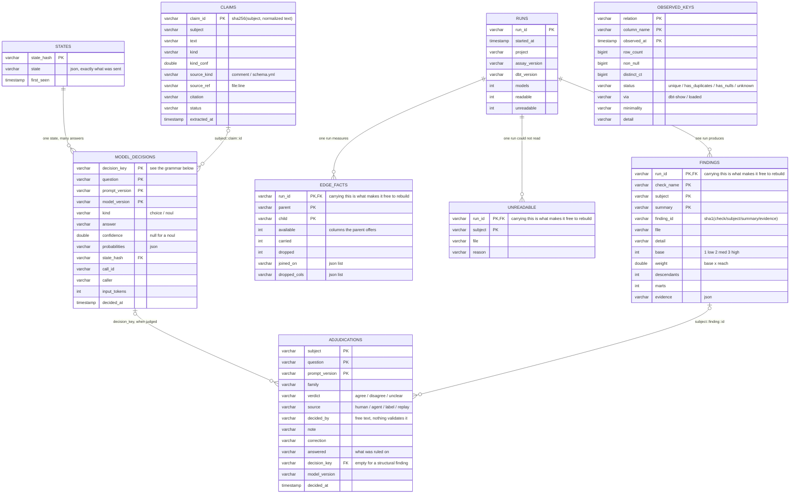

# The store

One DuckDB file, `assay.duckdb`, written by `assay check` and read by everything else. Nine
tables. The whole design turns on one split, so it is worth stating before the diagram:

**Some of these cost nothing and some of them cost money or somebody's afternoon.** A table
carrying `run_id` is exactly one `assay check` rebuilds for free, offline, in seconds. A table
without one holds something that was paid for — a model call, or a person reading SQL. `assay
prune` deletes only the first kind, and the split is declared in code rather than inferred:

```python
PRUNABLE     = ("findings", "edge_facts", "unreadable")
NEVER_PRUNED = ("model_decisions", "claims", "adjudications", "observed_keys", "runs")
```

A new table belongs to one list or the other and a test fails until it does, so nothing becomes
silently prunable.

---

## The tables


<details>
<summary>the same thing as Mermaid source</summary>


</details>


`OBSERVED_KEYS` joins to nothing. It is keyed on `(relation, column_name, observed_at)` because it
is a **series**: a key that held last week and does not now is the failure that corrupts a
warehouse, and it is invisible to every check that describes the present. It needs two
observations to say anything, which is why the timestamp is in the key rather than being
overwritten.

---

## The joins are by convention, not by constraint

There are no foreign keys in the DDL. Two of these relationships are string grammar, which is
worth knowing before writing a query against them.

**`decision_key` names what a question was asked ABOUT.** It is a model's `unique_id`, optionally
with a suffix saying which of several questions on that model:

| shape | asked about |
|---|---|
| `model.p.orders` | the model itself — grain, role, provenance |
| `model.p.orders::claim::a1b2c3` | one atomic claim, joining `claims.claim_id` |
| `model.p.orders::edge::model.p.items` | one hop into it |
| `model.p.orders::desc` | its schema.yml description |
| `model.p.orders::pred::41` | a filter it applies |

**`adjudications.subject` is the same grammar plus one more.** `model.p.orders::finding::4f2a` is
a verdict on ONE finding rather than on the model, and it is the shape that makes dismissal and
the loop measurement possible — a verdict filed against the bare model cannot say which of that
model's eight findings was the real one.

`adjudications.decision_key` is the path back to the probability a verdict ruled on. It is **empty
for a structural finding**, and that is correct rather than missing: a parser decided it, no
question was asked, and there is no number to calibrate. On one real store, 97 of 105 agent
rulings were structural, so a calibration report has to exclude them by construction.

---

## What each table answers

| table | the question | cost to rebuild |
|---|---|---|
| `runs` | what has been run here, and against what | free, but it IS the log |
| `findings` | what is wrong right now | free |
| `edge_facts` | what each hop carries and drops | free |
| `unreadable` | what assay could not parse, and why | free |
| `model_decisions` | what a judged question answered | **a model call** |
| `states` | what that answer was computed FROM | free once the call is made |
| `adjudications` | what a person or agent concluded | **somebody's afternoon** |
| `claims` | what this project asserts, as data | **a model call** |
| `observed_keys` | what a count actually found, over time | **a warehouse query** |

---

## Two properties that are load-bearing

**A finding's identity survives a rerun and changes when the substance changes.** `finding_id` is
`sha1(check | subject | summary | evidence-minus-measured-values)`. Floats and counted values are
excluded on purpose, so a probability moving by 0.01 does not mint a new finding. This is what
lets a dismissal stick across runs and lapse by itself when the model is edited into a genuinely
different defect.

**A verdict is evidence about a question AND the state it was given.** `prompt_version` is in the
primary key of both `model_decisions` and `adjudications`, so a verdict recorded against v1 is a
different row from one against v4 and cannot silently authorize it. The suffix on a version
(`+scoped+description_only`) records the STATE SHAPE rather than the question text — a known gap
is that `stale_decisions` compares only the base, so changing what gets sent is not counted by
anything.
